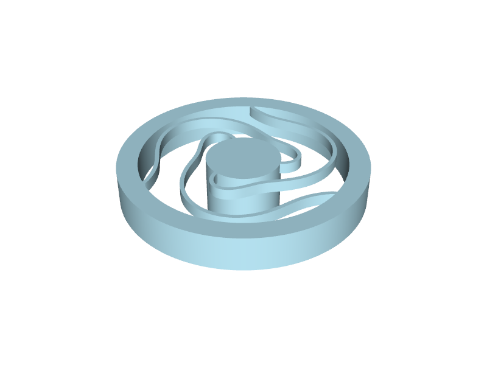
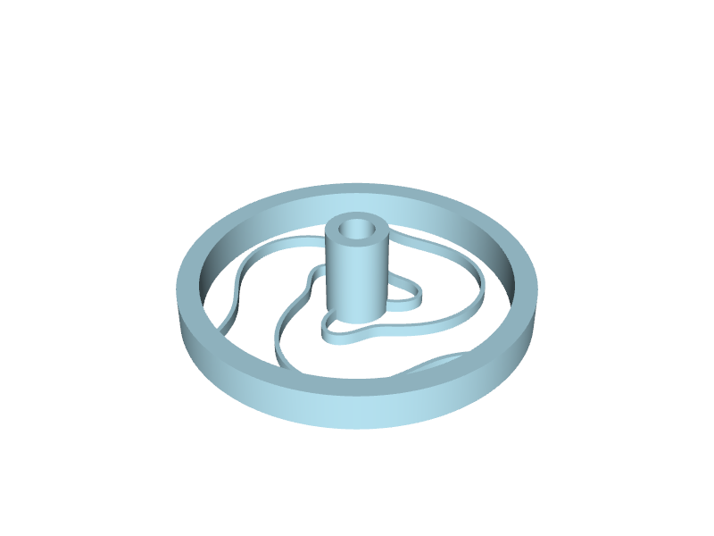

# 3d-printed-spring

An **orthoplanar spring with an isotropic resonant frequency**, designed in [build123d](https://github.com/gumyr/build123d) and validated with [Netgen / NGSolve](https://ngsolve.org/) finite-element modal analysis.



> **How this was made.** The geometry, the FEA validation pipeline, the parameter sweep, this README and `DESIGN.md` were all generated in a single Claude Code session driven only by [build123d-mcp](https://pypi.org/project/build123d-mcp/) from this one prompt:
>
> > make an orthoplanar spring with an isotropic resonant frequency in PLA, and to validate it in netgen ( reading the comments in https://github.com/gumyr/build123d/issues/297 for netgen help)
>
> No human-written CAD or FEA code. The full session is reproducible by re-running the published [build123d-mcp](https://pypi.org/project/build123d-mcp/) server against the same prompt.

## In plain English

Picture a flat disc the size of a £2 coin: a thick outer ring, a heavy little post in the middle, and three thin wiggly arms in the gap connecting them. The outer ring is what you'd clamp down, and the central post is a small proof mass. Flick the centre in any direction and it bounces back and forth on the arms like a mass on a spring. Different springs prefer to bounce in different directions — a typical flat spring is happy to bobble up and down but feels rigid edge-on. The goal here was a spring that feels **equally bouncy in all three directions** — up/down, left/right, front/back — so a tap produces essentially the same little hum whichever way you push the proof mass. That property is what "isotropic resonant frequency" means.

Making it work meant fighting against the natural anisotropy of a flat spring. Flat springs are floppy out of plane and stiff in plane; we wanted them equal. Two design moves get us there: the arms are made **taller than they are wide** (1.0 mm in plane × 2.7 mm thick), which softens sideways flexing relative to up-and-down, and each arm follows a **wiggly, snake-like path** so that pushing the centre sideways mostly bends the arms gently rather than stretching them lengthwise (stretching is what was making sideways feel too stiff). After tuning, an open-source physics simulator (Netgen + NGSolve, the same kind of finite-element analysis engineers use to predict how parts vibrate) confirmed all three bouncing directions land at roughly **33 Hz, within 2 % of each other**.

## Design parameters

| Parameter | Value | Notes |
|---|---|---|
| Outer diameter | 60 mm | clamp ring 5 mm wide (rim ID 50 mm) |
| Proof-mass hub diameter | 18 mm | with a 12 mm cylinder hanging below as mass |
| Plate / arm thickness (z) | 2.7 mm | |
| Arm width (in plane) | 1.0 mm | square-ish cross-section, slightly tall |
| Number of arms | 3 | 120° rotational symmetry → enforces f_x ≡ f_y |
| Arm sweep | 220° | with a sinusoidal 4-lobe radial wiggle, 4 mm amplitude |
| PLA mass | ~14.7 g | density 1.24 g/cm³ |
| First three resonances | **32.6 / 33.2 / 33.2 Hz** (z / x / y) | ratio 1.017 (1.7 %) |

See [`DESIGN.md`](DESIGN.md) for the engineering writeup — why orthoplanar springs are naturally anisotropic, the two knobs that fix it, the FEA workflow, and the parameter-sweep that landed on these numbers.

## Variants

Three presets are exposed in `spring.spring`. Same arm topology and isotropic tuning across all three — the differences are only in the rim/hub geometry and proof-mass strategy.

| Preset | Application | OD | Notes |
|---|---|---|---|
| `SpringParams()` (default) | Isotropic ~33 Hz reference design | 60 mm | Original "buzz once" demo, ~0.3–1 s perceptible ring. Hub hangs below the plate as integral proof mass. |
| `big_ring_params()` | Long ring time, symmetric proof mass | 80 mm | Hub extends *both sides* of the plate with M6 heat-set pockets on top and bottom. Best CoM symmetry → cleanest 3-axis isotropy, but **needs supports** on one hub side when printing. |
| `big_ring_support_free_params()` | Long ring time, no supports | 80 mm | Hub extends only *above* the plate (single tall column). M6 pockets in the same hub — top one drilled from above, bottom one drilled into the plate's underside. Prints flat with **no supports**. Mild asymmetry in proof mass; isotropy still ≤5 %. |



**Ring time tuning** (perceptible ring duration ≈ `3 Q / (π f)`):

Measured for the original 33 Hz spring: Q ≈ 35 hand-held, Q ≈ 70 when the rim is rigidly clamped. To extend the ring, drop f by adding external mass to the hub via the M6 inserts. With the support-free 80 mm variant + ~25 g total external mass (12–13 g per side):

| Q | Loaded f | Perceptible ring (3 τ) |
|---|---|---|
| 50 (typical hand-clamp) | ~8.9 Hz | ~5.4 s |
| 70 (rigid clamp) | ~8.9 Hz | ~7.5 s |

## Print assumptions

- **Material:** PLA, FDM (E ≈ 2.5 GPa assumed for FEA — anisotropic in real prints, so the *absolute* frequency will shift ±15 % from layer effects; the *isotropy ratio* is geometric and unaffected).
- **Nozzle / layer:** 0.4 mm nozzle, 0.2 mm layer height (3 perimeters cover the 1 mm arm width).
- **Orientation:** Flat — proof-mass post and clamp boss point *down* into the bed; print upside-down with supports under the rim/hub. This keeps the arms loaded in plane (perpendicular to layers) for the dominant axial mode.
- **Supports:** Only under the rim and hub bosses; the arms themselves are flat on the bed.

## Development

```
git clone https://github.com/pzfreo/3d-printed-spring.git
cd 3d-printed-spring
uv sync --group dev
```

The MCP server is preconfigured in `.mcp.json` — any Claude Code (or MCP-compatible client) opened in this repo launches the published [build123d-mcp](https://pypi.org/project/build123d-mcp/) server on first tool use.

Re-run the modal analysis (needs Python 3.12 because of the `cadquery-ocp` ↔ `netgen-occt` OCCT-version match described in build123d [issue #297](https://github.com/gumyr/build123d/issues/297)):

```
uv run --python 3.12 --with netgen-mesher --with ngsolve python -m spring.validate
```

Or sweep parameters:

```
uv run --python 3.12 --with netgen-mesher --with ngsolve python scripts/sweep_isotropy.py
```

## License

Apache-2.0.
